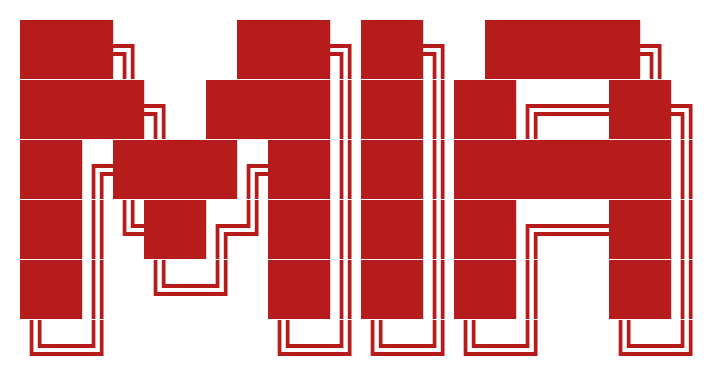

<p align="center">
  
</p>

<h1 align="center">MIA (Machine Intelligence Architecture)</h1>

<p align="center">
  <em>A personal AI engineering OS — compiled, local-first, self-improving.</em>
</p>

<p align="center">
  <a href="#quick-start">Quick Start</a> &bull;
  <a href="#core-pipeline">Core Pipeline</a> &bull;
  <a href="#architecture">Architecture</a> &bull;
  <a href="#philosophy">Design Philosophy</a>
</p>

---

### What is MIA

**MIA** (Machine Intelligence Architecture) is a compiled, local-first AI engineering harness that runs on your machine. It turns raw intent into verified code while compounding learnings across sessions.

- **Grill-to-Ship Pipeline** &mdash; Never write code without explicit clarification & verifiable plans.
- **Self-Improving Memory** &mdash; Every session logs learnings (`.jsonl`) with confidence decay and global wisdom.
- **Zero External Dependencies** &mdash; Single compiled Bun binary with sub-millisecond execution.

---

### Quick Start

```bash
# Install MIA OS
curl -fsSL https://raw.githubusercontent.com/thesohamdatta/Mia/main/scripts/bootstrap.sh | bash

# Daily engineering workflow
mia grill       # Clarification interview before non-trivial tasks
mia plan        # Create a verifiable plan with success criteria
mia spec        # Turn intent into PRD & atomic issue tickets
mia ship        # Test → health check → review → PR
```

---

### Core Pipeline

| Skill | Command | Purpose |
| :--- | :--- | :--- |
| **Grill** | `mia grill` | Clarification interview (never code without intent alignment) |
| **Plan** | `mia plan` | Verifiable task plan with explicit success criteria |
| **Spec** | `mia spec` | Turn intent into PRD & atomic issue tickets |
| **Health** | `mia health` | Code quality scorekeeper with baked-in verification |
| **Ship** | `mia ship` | Test verification → pre-landing review → git PR |
| **Learn** | `mia learn` | Capture typed learnings, confidence scores & decay |
| **Retro** | `mia retro` | Weekly retrospective with timeline + learnings |
| **Memory** | `mia memory` | Read/write long-term memory (~/.mia/memory.md) |
| **Checkpoint** | `mia checkpoint` | Save/resume working state |

---

### Architecture

```
~/.mia/
├── memory.md              # Global curated long-term wisdom
├── bin/
│   └── mia                # Single compiled binary (~50MB)
└── projects/{slug}/       # Per-repository learning store
    └── events.jsonl       # Unified event log (learnings, timeline, checkpoints)
```

**No daemon. No HTTP. No auth tokens. Just direct execution.**

---

### Design Philosophy

> *"Simple is deep. The harness is more important than the model."*

1. **Simple** &mdash; Remove everything until you can't. Single binary, local JSONL, zero bloat.
2. **Deep** &mdash; Clean interface on top, rich state engine underneath.
3. **Verifiable** &mdash; Evidence before claims. Verification baked into every execution step.

---

### Building from Source

```bash
git clone https://github.com/thesohamdatta/Mia.git
cd Mia
bun run build
```

---

<p align="center">
  MIT Licensed &bull; Built for engineers who ship.
</p>