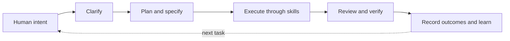

# MIA

**A local-first engineering harness for AI-assisted software development.**

MIA helps turn an intention into explicit work, a deliberate execution path, and evidence that the result was checked. It is a small Bun and TypeScript CLI built around a simple principle: the model can change; the engineering discipline should not have to.

> Clarify the work. Make the plan explicit. Execute. Verify. Learn.

## Start here

- **[Read the documentation](docs/README.md)** — the guided entry point for users and contributors.
- **[Get started](docs/getting-started.md)** — install dependencies and run MIA from source.
- **[Understand the architecture](docs/core/architecture.md)** — see how the CLI, skills, and local state fit together.
- **[Explore commands and skills](docs/core/skills-index.md)** — inspect the executable command surface.
- **[Contribute](docs/workflows/contributing.md)** — development setup, review, and verification.

## What MIA does

- **Makes intent explicit.** Clarify the problem, assumptions, risks, and definition of done before non-trivial implementation.
- **Structures work.** Create plans and durable Work records rather than relying on a transient chat transcript.
- **Keeps skills bounded.** Route named workflows through an explicit skill registry and capability checks.
- **Records evidence.** Persist verification results and approvals alongside project activity.
- **Preserves useful context.** Store learnings and checkpoints locally so work can resume.
- **Leaves the agent loop to the host.** MIA provides engineering workflow and state; the host owns model execution and tool routing.

## Quick start

Requirements: Git and [Bun](https://bun.sh/).

```bash
git clone https://github.com/thesohamdatta/Mia.git
cd Mia
bun install
bun run core/cli/index.ts --help
```

Run your first command:

```bash
bun run core/cli/index.ts grill start
```

To build the compiled CLI:

```bash
bun run build
```

See [Getting started](docs/getting-started.md) for more detail.

## How it works


```mermaid
flowchart LR
    Intent["Human intent"] --> Clarify["Clarify"]
    Clarify --> Plan["Plan and specify"]
    Plan --> Execute["Execute through skills"]
    Execute --> Verify["Review and verify"]
    Verify --> Learn["Record outcomes and learn"]
    Learn -. "next task" .-> Intent
```

This is a useful mental model, not a promise that every task must run every phase. The appropriate workflow depends on the task and on the current implementation.

## Current boundaries

MIA is actively evolving. The current runtime executes skills directly in the CLI process; it does not require the former daemon or an HTTP control plane. The agent host still owns its model loop and underlying tool runtime. The `ship` skill checks verification and handoff readiness; it does not push, merge, or open pull requests.

For precise behaviour, prefer the executable source and tests over a stale description. Start with [Architecture](docs/core/architecture.md), [Commands and skills](docs/core/skills-index.md), and [Testing strategy](docs/reference/testing-strategy.md).

## Project

- [GitHub repository](https://github.com/thesohamdatta/Mia)
- [Documentation index](docs/README.md)
- [MIT license](LICENSE)
