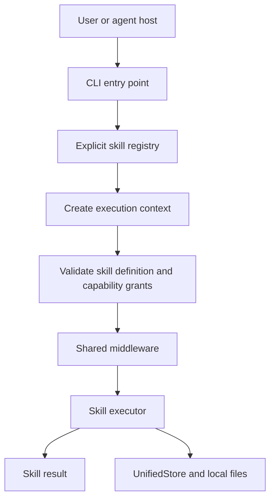

# MIA architecture

MIA is a local-first Bun CLI that wraps AI-assisted engineering work in explicit workflows and durable state. Skills execute in the CLI process; a separate daemon and HTTP control plane are not part of the current runtime.

## Execution path

The host still owns its model loop, tool routing, and session lifecycle. MIA supplies the workflow and state boundary around that host.

## Main components

| Component | Responsibility |
|---|---|
| CLI | Parses the requested skill and arguments; provides help and version output. |
| Skill registry | Maps supported command names to explicit skill definitions. |
| Execution context | Carries the working directory, project identity, runtime paths, granted capabilities, and shared store. |
| Admission and executor boundary | Validates a skill definition and checks required capabilities before running the skill. |
| Middleware | Adds shared pre- and post-execution behaviour such as project checks and timeline activity. |
| UnifiedStore | Persists project events through the local JSONL-backed store. |
| Work and verification modules | Persist durable work lifecycle data and the results of configured checks. |

The registry is explicit in `core/skills/index.ts`. The runtime does not infer the available CLI surface by scanning Markdown files.

## Skill execution

A command follows the same broad sequence:

1. The CLI resolves the command to a registered skill.
2. MIA creates an execution context for the current project.
3. The execution boundary validates the skill definition and capability grants.
4. Shared middleware runs around the skill executor.
5. The result and any relevant work, timeline, learning, verification, or approval state are persisted through their owning modules.

Not every skill writes every kind of state. A read-oriented skill and a verification skill have different side effects.

## Local state

The active runtime uses `MIA_DIR`, defaulting to `~/.mia`. Runtime paths are derived from this root. Project identity is based on the Git repository root; outside a Git repository, MIA falls back to `default`.

The JSONL event store uses per-project `events.jsonl` records. Current event types include learning, timeline, checkpoint, evidence, and approval. Work records have their own persistence boundary; the event stream is not the sole store for every domain object.

## The host boundary

MIA does not implement a second agent loop. A host such as Codex or Claude Code owns model execution, tool routing, and session behaviour. MIA provides registered workflows, capability admission, durable work state, and verification evidence.

Capability admission is not itself a tool sandbox. It checks the grants represented in the execution context; the host remains responsible for the underlying tool runtime and its security boundaries.

## Configuration boundary

The active CLI uses `MIA_DIR` and derives the normal runtime paths from it. A broader `core/config/ConfigLoader` exists in the repository but is not currently wired into `createExecutionContext()`. Treat its additional options as transition or compatibility code unless the runtime is updated.

## Architecture decision

The earlier daemon and HTTP path was removed because it added a process and lifecycle without a demonstrated need for an independent service. See [ADR-0001: Eliminate Daemon](../decisions/ADR-0001-eliminate-daemon.md).

## Source map

- CLI: `core/cli/index.ts`
- Registry: `core/skills/index.ts`
- Execution boundary: `core/skills/executor.ts`
- Context: `core/context.ts`
- Middleware: `core/skills/preamble.ts`
- Event store: `core/state/unified-store.ts`
